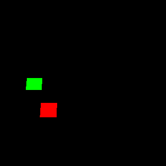

SnakeNet is an easy to read easy to run Q Learning implementation for the classic game snake.

SnakeLearn.py trains an AI from scratch.  Note that the AI is not given any instructions about the rules of the game prior to play.  If the AI attempts an illegal move (going backwards, walking out of bounds, ect.) this is treated as a death.  Use command line options to adjust the settings and observe changes in snake performance.

SnakeNet saves a highlight reel of each snake generation as a gif.

Generation 1

Generation 2

Generation 3

Generation 4

Usage: python SnakeLearn.py
